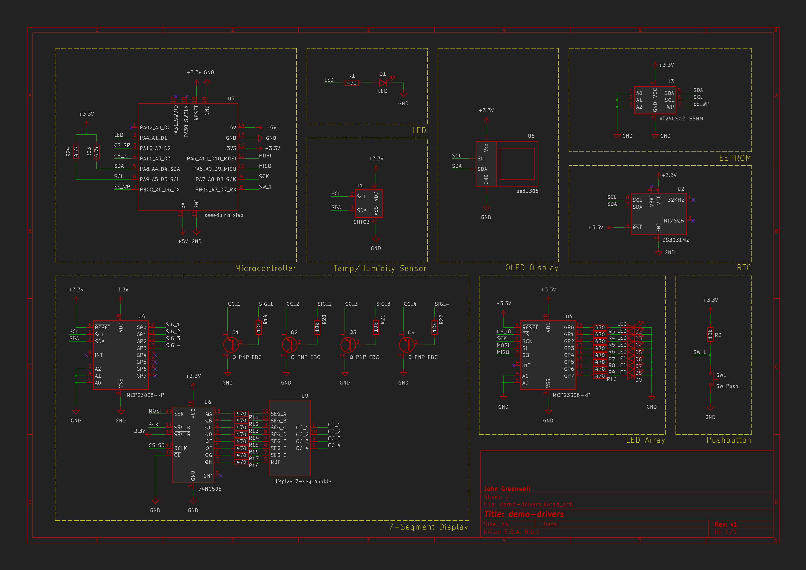

# Custom Drivers Demonstration

Custom HAL drivers implementation demo

## Overview

This test project demonstrates the use of custom drivers written for a flexible HAL layer. The [Seeeduino Xiao microcontroller](https://wiki.seeedstudio.com/Seeeduino-XIAO/) is used as an example platform, while the drivers/devices under test (DUT) are:

* [LED](https://github.com/johnmgreenwell/led)
* [Switch](https://github.com/johnmgreenwell/switch)
* [EEPROM](https://github.com/johnmgreenwell/at24cxx)
* [RTC](https://github.com/johnmgreenwell/ds3232)
* [Temp/humidity sensor](https://github.com/johnmgreenwell/htu21d)
* [SSD1306](https://github.com/johnmgreenwell/ssd1306)
* [7-Segment display](https://github.com/johnmgreenwell/micro7seg)
* [GPIO expander (I2C)](https://github.com/johnmgreenwell/mcp23008)
* [GPIO expander (SPI)](https://github.com/johnmgreenwell/mcp23s08)
* [Shift register](https://github.com/johnmgreenwell/shift-register)

Each of the drivers is tested by direct interface or as a subset of another driver. The tests are not exhaustive for each driver, as it is sufficient to demonstrate a practical application of each.

Each component operates as intended as it is controlled by its respective driver.

## Usage

This project may be built using PlatformIO with supporting configuration files as provided. Each driver is imported as a library dependency, compatible with a [PlatformIO](https://platformio.org/) configuration arrangement. Alternatively, this repo and the requisite dependencies for the Seeeduino Xiao Arduino framework may be used by a separate or custom build system.

## Schematic

The overall schematic for the test setup and associated CAD files are included as composed in [KiCad 8](https://www.kicad.org/blog/2024/03/KiCad-8.0.1-Release/).

## License

MIT © 2024 John Greenwell
